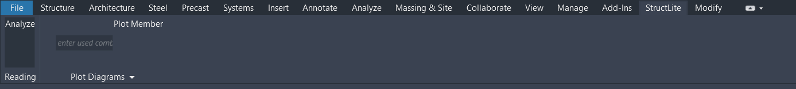
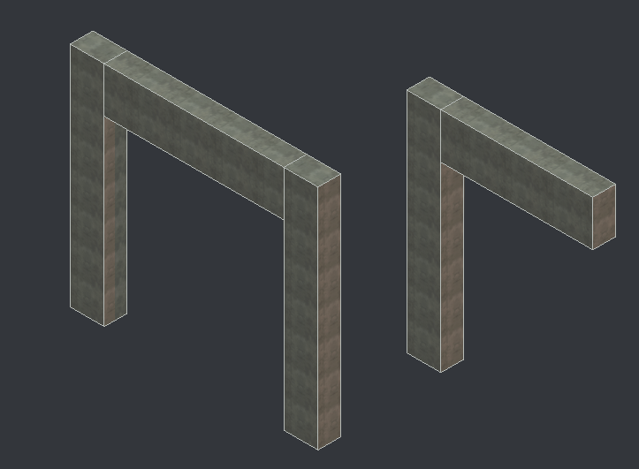
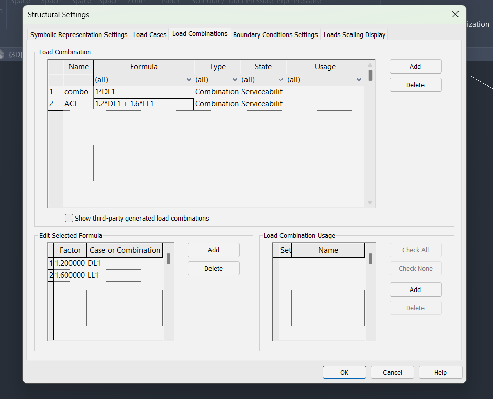
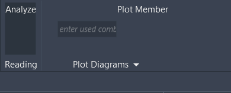
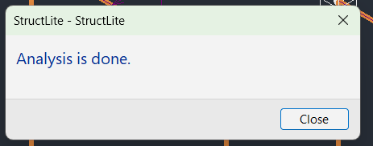
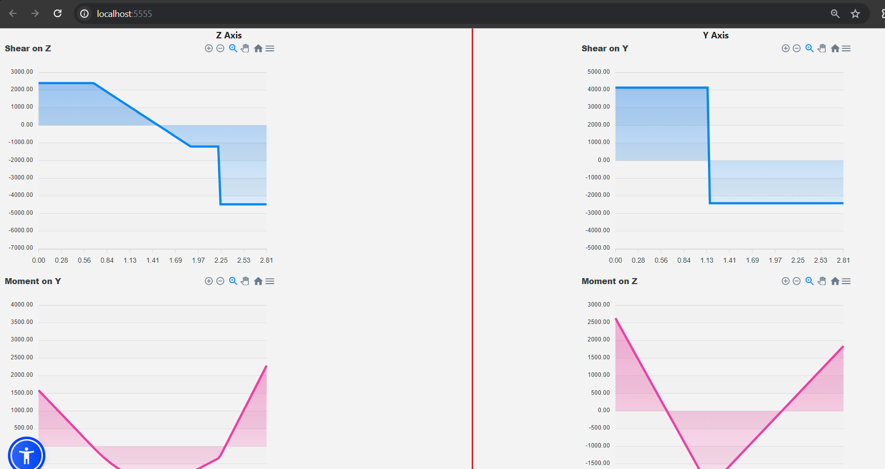
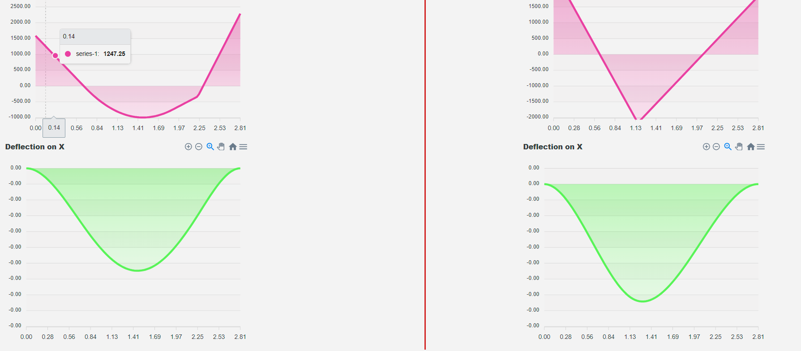

# StructLite - Simple Finite Element Analysis in Revit
An easy to use elastic 3D structural engineering finite element analysis Plugin for Revit Software.
## Installation
1- Download the 'Release' Folder.

2- Add `StructLite24Dev.addin` file to `C:\ProgramData\Autodesk\Revit\Addins\2024`.

3 - Edit `StructLite24Dev.addin` file for the new path of the plugin.

* The Plugin works only on Revit 2014 version.

## StructLite Engine Capabilities
* Linear Static Structural Analysis for 3D Members.
* Perform Analysis on Revit Rectangular Concrete Beams and Columns (member Elements).
* Produces shear, moment, and deflection results and diagrams for each member.
* Classify loads by load case and create load combinations from load cases.
* Member point loads, linearly varying distributed loads, and nodal loads are supported.

## Analysis Derivations
* [Model Analysis](docs/ModelAnalysis.md)
* [Member Element](docs/MemberElement.md)

## Use
Once you installed Structlite, you should see Structlite Tab in your Revit Menu.

Then you can start build your model with revit.
Please make sure for every physical element, there is analytical element exist like the photos below:

Add load combinations:

Press Analyze Btn

You should get this windows when the analysis is finished

Now you can write the combo name and press 'Plot Member' Btn to see the diagrams for the member you have chose:

## Dev
[Dev Notes](docs/Dev.md)

* All thanks for Craig, the owner of [PYNITE](https://github.com/JWock82/PyNite) for inspiration and making sure I did the calculations correctly.
